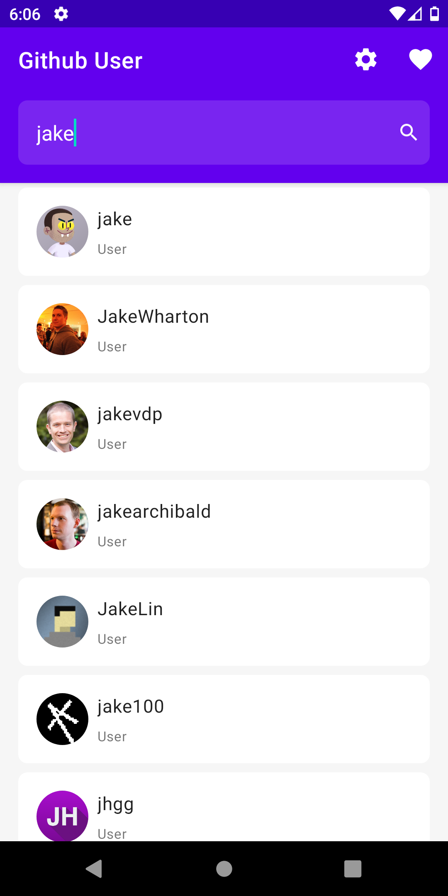
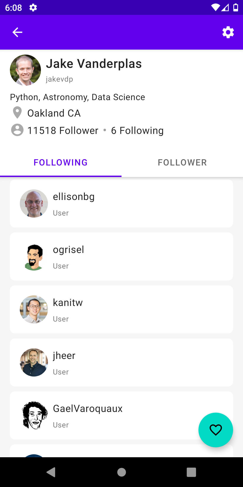
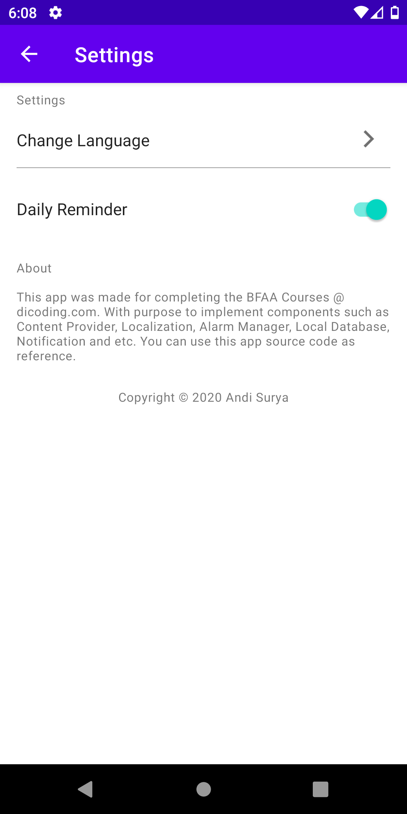
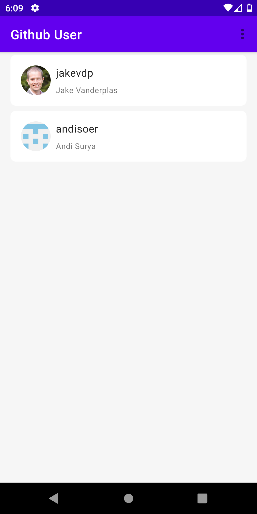

# dicoding-bfaa-submission
  

This repository containt my last and final submission for [Dicoding BFAA Course](https://www.dicoding.com/academies/14) which impelement Android Widget or Component such as Content Provider, Local Database, Localization, Notification, Alarm Manager, and MVVM Architecture. This repo also include 2 modules (app & consumerapp) with each module must comnunicate each other using Content Provider.

## Screenshots

    
    
    
    

## List of Features
- ##### app Module
  - Home (Search for Github Users)
  - Github Users Detail
  - Settings
    - Alarm Reminder
    - Localization (Change Language)
  - Add to favorite and Delete from favorite
- ##### consumerapp Module
  - Home (List of favorited users)
  - Github Favorited User Detail
  - Remove to favorite
  - Localization (Change Language)
  
## Tech Stacks 🛠
- Kotlin (Programming Language)
- Room (Layer build on top of SQLite)
- Content Provider
- Alarm Manager
- Notification (for Alarm Manager)
- MVVM (Architecture)
- Jetpack Navigation Component
- Retrofit (Network Library)
- Glide (Image Loading Library)

## Support ❤️
Star this repository would be really appreciated :D
